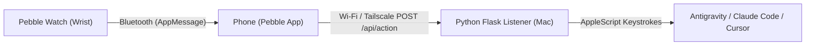

# Pebble Coding Agent Approval (Antigravity & AI Coding Assistants)

[](https://opensource.org/licenses/Apache-2.0)
[](https://rebble.io)
[](https://www.python.org/)

One-click physical wrist approvals for AI coding agents (**Google Antigravity**, **Claude Code**, **Cursor**) using your Pebble smartwatch (**Pebble Time 2**, **Pebble Time**, **Pebble Time Steel**, **Pebble Time Round**, **Pebble 2**).



---

# 🚀 Part 1: Quickstart for App Store Users

If you downloaded **Agent Approvals** from the [Rebble Appstore](https://apps.rebble.io/), follow these simple steps to connect your watch to your computer:

### Step 1: Install the Watch App
1. Open the **Pebble / Rebble mobile app** on your iOS or Android phone.
2. Search for **"Agent Approvals"** and tap **Install** (or sideload `pebble_app.pbw`).

---

### Step 2: Clone the Companion Listener Service
On your Mac or PC, clone this repository:

```bash
git clone https://github.com/savelee/pebble_coding_agent_approval.git
cd pebble_coding_agent_approval
```

Set up dependencies using **UV** or standard Python:

```bash
# Using UV (Recommended)
uv venv .venv
source .venv/bin/activate
uv pip install -r requirements.txt

# Or using Make
make venv
```

---

### Step 3: Start the Listener Service
Run the lightweight background listener on port `5000`:

```bash
source .venv/bin/activate
python -m listener.app
```

The listener binds to `0.0.0.0:5000` and is ready to receive button events from your watch.

---

### Step 4: Grant macOS Accessibility Permissions
Synthetic keystroke injection and window activation require Accessibility permissions:
1. Open **System Settings** on your Mac.
2. Navigate to **Privacy & Security** > **Accessibility**.
3. Enable (toggle **ON**) the following applications:
   * **Antigravity IDE** (or `Antigravity.app`)
   * **Cursor** / **Claude Code** (if running standalone)
   * **Terminal** / **iTerm2** / **VS Code** (the terminal where you run `python -m listener.app`).

---

### Step 5: Get Your Computer's IP Address (Local or Tailscale)

#### Option A: On the Same Local Wi-Fi Network
In a terminal window on your Mac, find your local network IP:
```bash
ipconfig getifaddr en0
```
*(Example: `192.168.1.100`)*

#### Option B: Outside the Network (Using Tailscale VPN)
If you want to approve actions when your phone is on cellular data or outside your home network:
1. Install [Tailscale](https://tailscale.com/) on your computer and phone.
2. Note your computer's Tailscale 100.x IP address (e.g. `100.85.120.45`).

---

### Step 6: Configure the Settings Screen in the Pebble App
1. Open the **Pebble App** on your phone.
2. Go to the **Locker / Apps** tab.
3. Tap **Agent Approvals** $\rightarrow$ tap the **Settings (gear icon)**.
4. Fill in:
   * **Listener Host / IP Address**: Enter your local IP (e.g. `192.168.1.100`) or Tailscale IP (e.g. `100.85.120.45`).
   * **Port**: `5000`.
5. Tap **Save & Close**.

---

### Step 7: Approve Actions from Your Wrist!
Whenever **Antigravity**, **Claude Code**, or **Cursor** requests permission to execute a command or modify files:
* 🟢 **UP BUTTON**: Confirms the prompt (injects `"i confirm\n"`) with haptic pulse.
* 🔴 **DOWN BUTTON**: Disapproves the prompt (injects `"i disapprove\n"`) with haptic pulse.
* 🔵 **SELECT BUTTON**: Re-opens the layout preview and info screen.

---

# 🛠️ Part 2: Developer & Contribution Guide

For developers who want to customize, test, compile, or build upon this project:

## 🏗️ Repository Architecture

```
pebble_coding_agent_approval/
├── listener/                   # Python Flask Companion Backend
│   ├── app.py                  # API endpoints (/api/action, /healthz)
│   ├── config.py               # Pydantic Settings
│   └── services/               # Platform-aware AppleScript keystroke injector
├── pebble_app/                 # Pebble Smartwatch C & PebbleKit JS App
│   ├── src/c/                  # Native C codebase (ui.c, splash.c, main.c)
│   ├── src/pkjs/               # PebbleKit JS HTTP dispatcher & settings HTML
│   ├── resources/              # 25x25 menu icons and splash bitmaps
│   └── package.json            # Pebble SDK manifest & target platforms
├── store_assets/               # Rebble App Store submission assets
├── tests/                      # Pytest unit test suite (99% coverage)
└── Makefile                    # Development automation targets
```

---

## 💻 Pebble SDK Setup & Building

### Prerequisites
* Pebble SDK 4.3+ (`pebble-tool`)
* ARM Embedded Toolchain (`arm-none-eabi-gcc`)
* Python 3.11+ / UV

### Compile the Watchapp Binary (`.pbw`)
```bash
cd pebble_app
pebble clean
pebble build
```
The compiled multi-platform package will be output to `pebble_app/build/pebble_app.pbw`.

---

## ⌚ Testing with the Pebble QEMU Emulator

You can test the watch app without physical hardware using the Pebble emulator:

```bash
# 1. Start the Pebble Time 2 (Emery) emulator
pebble emu-app-start --emulator emery

# 2. Install and launch the app in the emulator
pebble install --emulator emery

# 3. View live watch logs in real time
pebble logs --emulator emery
```

*(To test on other hardware targets, replace `emery` with `basalt`, `chalk`, `diorite`, or `aplite`)*.

---

## 📲 Sideloading Custom Builds to a Physical Watch

### On Android:
1. Start a local HTTP download server:
   ```bash
   python3 -m http.server 8080 --directory pebble_app/build
   ```
2. On your phone's browser, navigate to `http://<YOUR_MAC_IP>:8080`.
3. Tap **Download**, then select **Open with Pebble** $\rightarrow$ **Install**.

### On iPhone:
1. Locate `pebble_app/build/pebble_app.pbw` in macOS Finder.
2. **AirDrop** the `.pbw` file directly to your iPhone and choose **Open in Pebble**.

---

## 🧪 Running Automated Tests & Linting

```bash
# Run pytest unit test suite (99% statement coverage)
DEVELOPER_DIR=/Library/Developer/CommandLineTools make test

# Code formatting and linting
DEVELOPER_DIR=/Library/Developer/CommandLineTools make format
DEVELOPER_DIR=/Library/Developer/CommandLineTools make lint
```

---

## 🏬 Rebble App Store Submission & Asset Generation

To regenerate all store banners, 25x25 menu icons, and multi-platform screenshots:

```bash
# Generate store icons, 720x320 banner, and 200x228 Emery screenshots
source .venv/bin/activate
python generate_store_assets.py
python generate_all_platforms.py
python verify_store_assets.py
```

Store listing metadata, tags, and descriptions are documented in **[APPSTORE.md](file:///Users/leeboonstra/Documents/Github/pebble/approve/APPSTORE.md)** ready to submit to the [Rebble Developer Portal](https://dev-portal.rebble.io/).

---

## 📄 License

Licensed under the Apache License, Version 2.0. Author: Lee Boonstra ([@savelee](https://github.com/savelee)).
