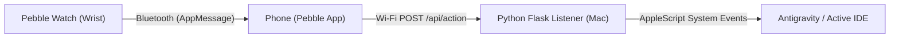

# Pebble Coding Agent Approval (Antigravity)

[](https://opensource.org/licenses/Apache-2.0)
[](https://rebble.io)
[](https://www.python.org/)

A Pebble Smartwatch application (Pebble Time, Pebble Time Steel, Pebble Time 2) and companion Python Flask listener service that enables developers to approve or disapprove AI coding assistant prompts (**Google Antigravity**, **Cursor**, **Claude Code**) directly from their wrist.

Repository: **[https://github.com/savelee/pebble_coding_agent_approval](https://github.com/savelee/pebble_coding_agent_approval)**

---

## ⌚ Smartwatch Interface & Physical Controls

* **Splash Screen**: Branded startup screen displaying `AGENT APPROVALS by @savelee`.
* **Top Half (Kelly Green)**: Confirm circle button with checkmark badge.
  * **Up Button**: Sends confirmation action (`"i confirm\n"`) with haptic vibration pulse.
* **Bottom Half (Crimson Red)**: Disapprove circle button with cross ('X') badge.
  * **Down Button**: Sends disapproval action (`"i disapprove\n"`) with haptic vibration pulse.
* **Top Header Bar**: Real-time status indicator (`READY`, `CONFIRMING...`, `DISAPPROVING...`, `SENT OK`, `NET ERROR`, `TIMEOUT`).
* **Settings (Clay / Webview)**: Configure your computer's local IP address and port directly from the Pebble app on your phone.

---

## 🏗️ Architecture Overview



---

## 📋 Complete Setup & Getting Started Guide

Follow these steps to get everything running end-to-end:

### Step 1: Enable macOS Accessibility Permissions
Synthetic keystroke injection on macOS requires Accessibility permissions:
1. Open **System Settings** on your Mac.
2. Go to **Privacy & Security** > **Accessibility**.
3. Toggle **ON** the following applications:
   * **Antigravity IDE** (or `Antigravity.app`)
   * **Terminal** / **iTerm2** / **Visual Studio Code** (the terminal where you run the Python listener).

---

### Step 2: Start the Python Listener Service
The listener service receives button actions from your watch over your local Wi-Fi network and types them into your active Antigravity prompt.

```bash
# 1. Clone the repository
git clone https://github.com/savelee/pebble_coding_agent_approval.git
cd pebble_coding_agent_approval

# 2. Create the virtual environment and install dependencies
make venv

# (Or manually using UV)
uv venv .venv
source .venv/bin/activate
uv pip install -r requirements.txt -r requirements-dev.txt

# 3. Start the Flask listener service (binds to 0.0.0.0:5000)
source .venv/bin/activate
python -m listener.app
```

The terminal will display:
```
 * Serving Flask app 'listener.app'
 * Running on http://127.0.0.1:5000
```

---

### Step 3: Find Your Mac's Local IP Address
In a new terminal window on your Mac, find your Wi-Fi IP address:
```bash
ipconfig getifaddr en0
```
*(Note down this IP, e.g. `192.168.1.100`)*

---

### Step 4: Install the Watch App on Your Pebble

#### On Android:
1. Start a temporary file server on your Mac:
   ```bash
   cd pebble_app/build && python3 -m http.server 8080
   ```
2. Open Chrome on your Android phone (connected to the same Wi-Fi) and visit `http://<YOUR_MAC_IP>:8080/pebble_app.pbw`.
3. Download the file, tap **Open with Pebble** (or Rebble), and tap **Install**.

#### On iPhone:
1. Locate `pebble_app/build/pebble_app.pbw` on your Mac.
2. **AirDrop** the file to your iPhone and select **Open with Pebble**.
3. Tap **Install**.

#### On Pebble Emulator (Mac):
```bash
cd pebble_app
pebble build
pebble emu-app-start --emulator emery
pebble install --emulator emery
```

---

### Step 5: Configure the Listener IP in the Pebble Mobile App
1. Open the **Pebble App** on your phone.
2. Go to the **Locker / Apps** tab.
3. Tap **Agent Approvals** $\rightarrow$ tap the **Settings** (gear icon).
4. Fill in:
   * **Listener Host / IP Address**: Enter your Mac's IP (e.g. `192.168.1.100`, or `127.0.0.1` if testing in emulator).
   * **Port**: `5000`.
5. Tap **Save & Close**.

---

### Step 6: Use Your Watch for Approvals!
Whenever **Antigravity**, **Cursor**, or **Claude Code** prompts for approval:
* Press the **UP Button** on your watch $\rightarrow$ Sends `"i confirm"` and presses Enter.
* Press the **DOWN Button** on your watch $\rightarrow$ Sends `"i disapprove"` and presses Enter.

---

## 🏬 Rebble App Store Submission

App Store listing metadata and descriptions are prepared in **[APPSTORE.md](file:///Users/leeboonstra/Documents/Github/pebble/approve/APPSTORE.md)**.

---

## 🧪 Automated Tests & Quality Checks

```bash
# Run unit test suite (99% coverage)
DEVELOPER_DIR=/Library/Developer/CommandLineTools make test

# Check code style & lints
DEVELOPER_DIR=/Library/Developer/CommandLineTools make lint
DEVELOPER_DIR=/Library/Developer/CommandLineTools make format
```

---

## 📄 License

Licensed under the Apache License, Version 2.0.
